# 🎓 MyNotion — a Notion alternative built for students

Everything a student needs for a semester, in one workspace: courses, notes,
flashcards, assignments, exams, a calendar, a weekly timetable, a study timer
and a grade tracker — organized around **semesters** instead of generic pages.

Works out of the box with no account: all data lives in your browser
(`localStorage`), fully private. Optionally, sign in with Google or GitHub and
sync to a real database — see [Cloud setup](docs/CLOUD_SETUP.md).

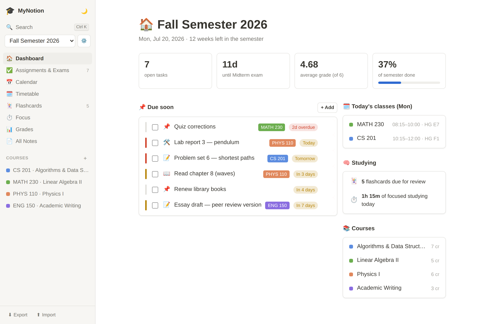

## Getting started

```bash
npm install
npm run dev      # http://localhost:5173
```

Production build: `npm run build` (output in `dist/`, deployable to any static
host). Merges to `main` auto-deploy to GitHub Pages via
`.github/workflows/deploy.yml`. The app is an installable PWA and works
offline in production builds.

**Optional cloud mode** — sign-in (Google/GitHub via Clerk) and a hosted
Postgres database (Supabase), both on free tiers. Copy `.env.example` to
`.env.local` and follow [docs/CLOUD_SETUP.md](docs/CLOUD_SETUP.md); without
configuration the app simply stays local-only.

## Features

### 🏠 Dashboard

One glance tells you where you stand: open tasks, days until your next exam,
your current semester average, and how far through the semester you are —
plus what's due soon and today's classes (screenshot above).

### 🔍 Quick Find (⌘K / Ctrl K)

Notion-style search palette: full-text search across every page (titles *and*
note content), task, course and semester — including semesters you're not
currently in; opening a result from another semester switches to it. With an
empty query it shows recently opened pages, navigation and quick actions, and
any query can become a new page with that title. Fully keyboard-driven.

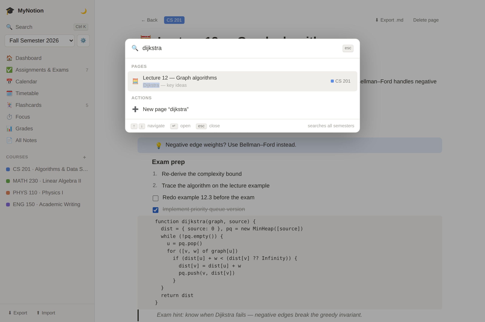

### ✅ Assignments & Exams

Tasks with a type (assignment / exam / reading / project / other), due date,
priority and course. Filter by status, type or course; overdue and due-soon
items are highlighted, everything is sorted by deadline.

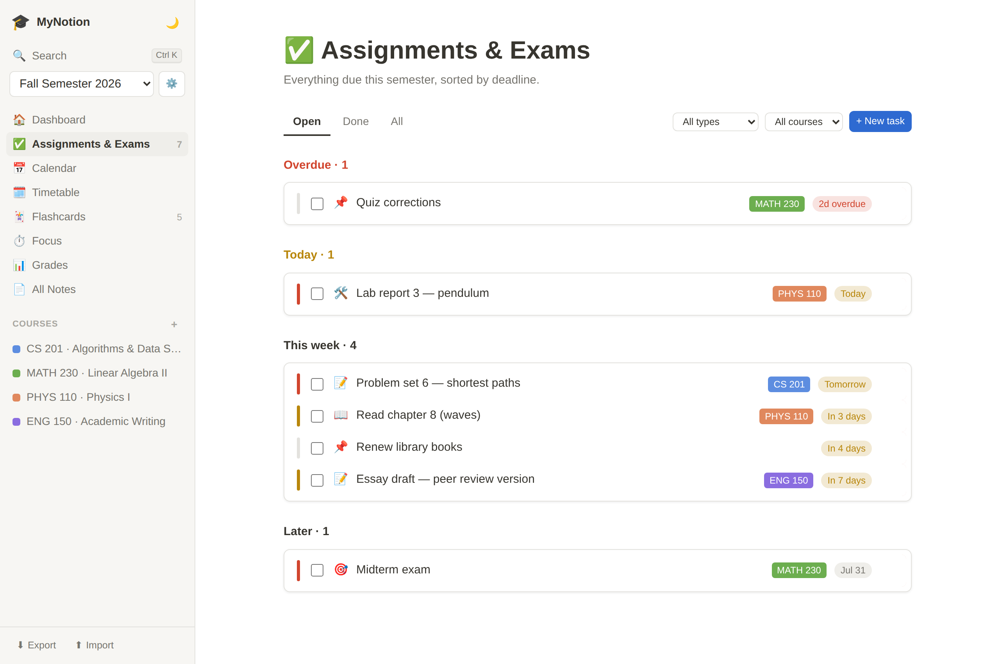

### 📅 Calendar & 🗓️ weekly timetable

A month calendar of all your deadlines — click a day to add a task there.
The timetable is auto-generated from each course's weekly meeting times
(day, start/end, room), color-coded by course; weekend columns appear only
if you actually have weekend classes.

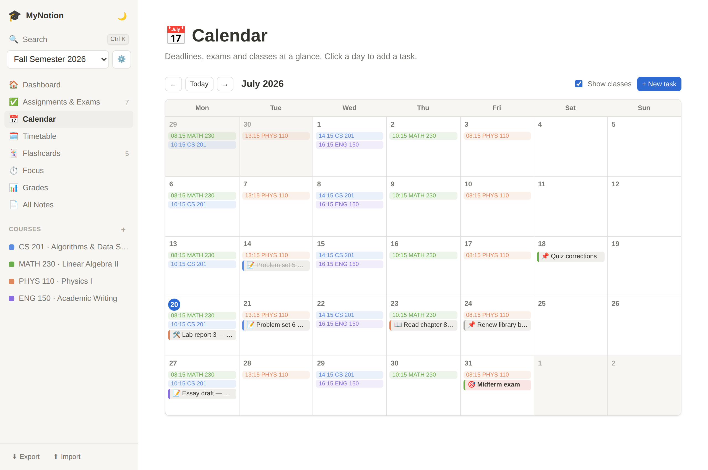

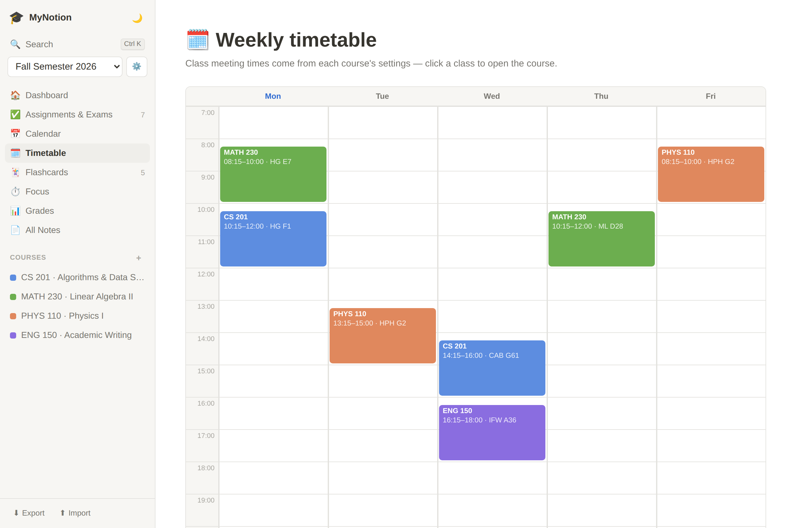

### 📝 Notion-style notes

A block editor with a **"/" command menu** (type `/` for a filterable menu of
block types) and markdown shortcuts: `# ` heading, `## ` subheading, `- `
bullet, `1. ` numbered list, `[] ` to-do, `> ` quote, ` ``` ` code, `---`
divider. Callouts, image blocks (paste or pick a file), Tab / Shift-Tab
indenting, Enter continues lists, ⌥↑/⌥↓ moves blocks. Pages can be general or
attached to a course, and any page can be exported as Markdown.

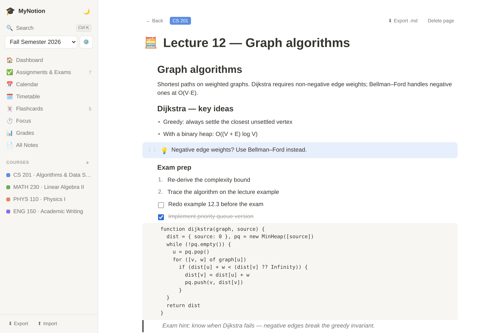

### 🃏 Flashcards

Spaced repetition (SM-2 style), one deck per course. Cards you find hard come
back sooner; the sidebar badge shows how many are due today.

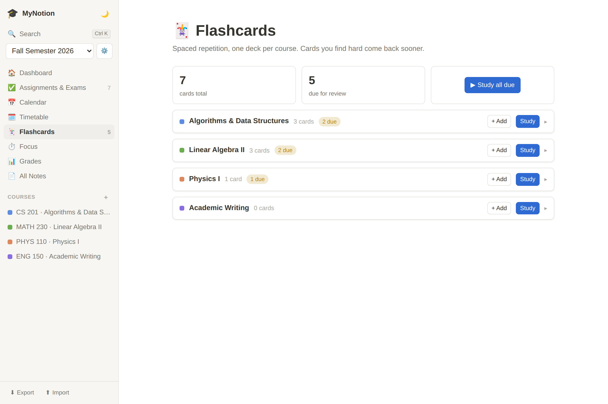

### ⏱️ Focus

Pomodoro-style focus sessions (15/25/50-minute presets), logged per course —
see study time today, over the last week, and where it actually went.

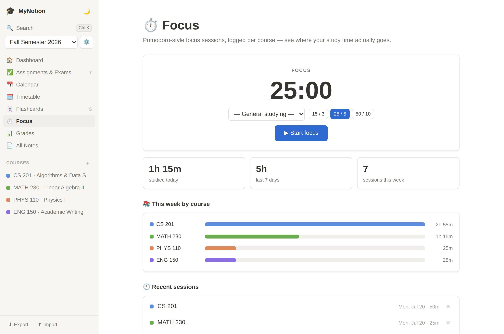

### 📊 Grades (Swiss system)

Grades on the Swiss 1–6 scale (6 best, 4.0 = pass). Enter grades directly or
compute them from points using the standard formula (5 · points ⁄ max + 1).
Course grades are weighted averages rounded to quarter grades (ETH-style);
the semester average is credit-weighted. Failing grades are highlighted.

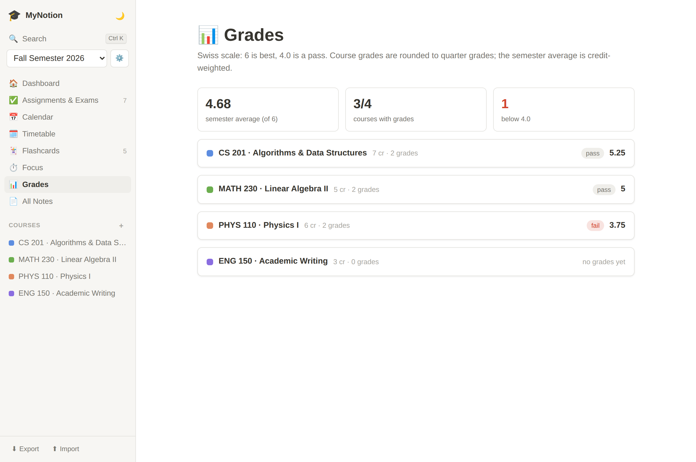

Each grade entry has a category and a percent weight; MyNotion warns you when
weights don't add up to 100%:

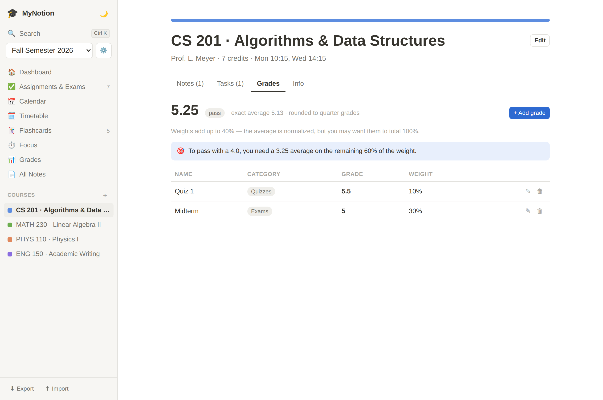

### 📚 Courses & semesters

Each course has a code, instructor, credits, a color and weekly meeting
times, and gets its own workspace with **Notes / Tasks / Grades / Info** tabs.
Semesters keep everything scoped: switch semesters from the sidebar and every
course, task, note and grade follows.

### 📱 Built for your phone too

On small screens the app switches to a mobile layout: a bottom tab bar, a
slide-in sidebar drawer and a top bar with search. The timetable becomes a
day-by-day agenda (tap a day chip or swipe to browse), tasks are swipeable
(right to complete, left for edit / delete), and dialogs open as bottom
sheets with touch-sized controls.

<p align="center">
  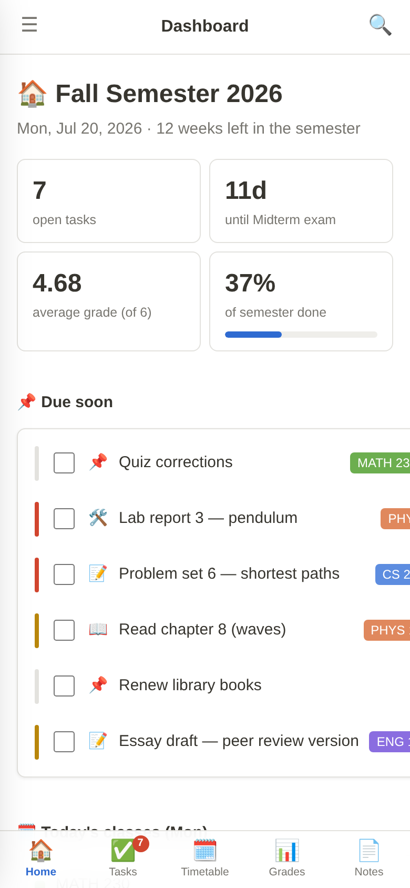
  &nbsp;&nbsp;
  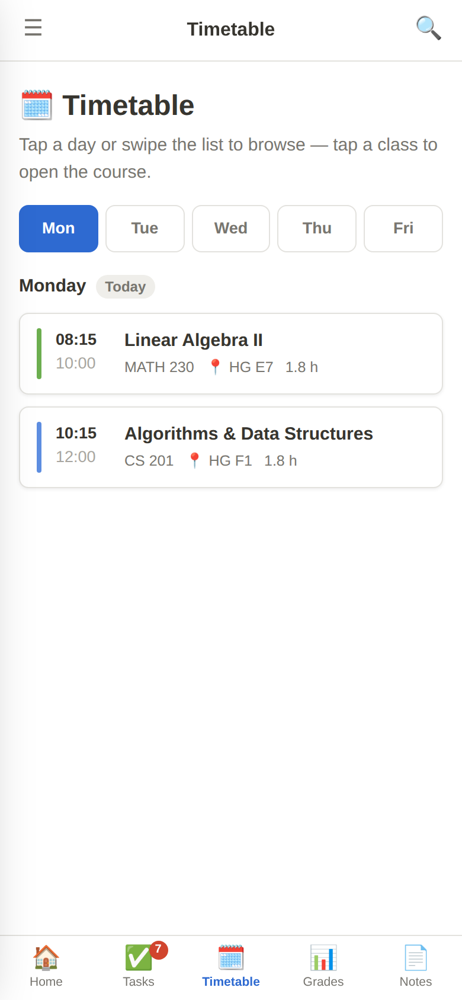
</p>

### 🌙 Dark mode & backups

Light and dark themes, plus JSON export / import for backups or moving
between browsers (stored data is versioned and migrated automatically).

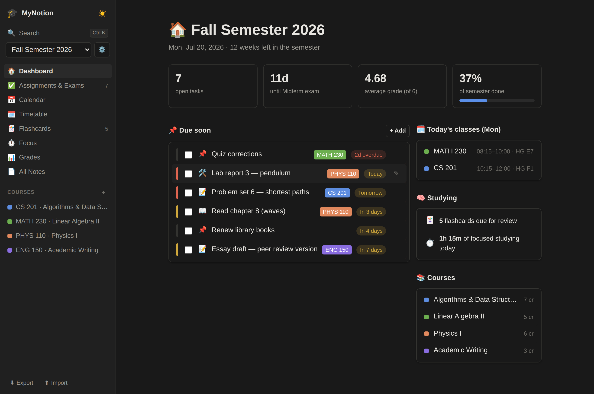

## Tech

React 18 + TypeScript + Vite. The only runtime dependencies beyond React are
the optional cloud integrations (`@clerk/clerk-react`, `@supabase/supabase-js`).

### Architecture

```
src/
  types.ts             Domain models (Semester, Course, Task, Page, GradeEntry,
                       Flashcard, StudySession)
  constants.ts         Shared constants (colors, icons, nav items, options)
  store/               App state: context provider, domain slice reducers,
                       localStorage persistence + schema migrations, selectors
  contexts/            Cross-cutting UI state: theme, navigation, Quick Find,
                       focus timer
  hooks/               Generic reusable hooks (useWindowEvent, useFormState)
  utils/               Pure helpers: dates, grade math, SRS scheduling,
                       study-session stats, safe storage access
  components/          Small shared UI primitives (Modal, Field, ColorDot…)
  features/            One folder per feature — each owns its views, components
                       and feature-specific logic:
                       layout, semesters, courses, tasks, notes, editor,
                       grades, timetable, calendar, flashcards, focus,
                       dashboard, quick-find, auth, cloud
supabase/schema.sql    Database schema for the optional cloud mode
```

Conventions: components read state through context hooks (`useAppState`,
`useActiveSemester`, `useNavigation`, `useTheme`) rather than prop drilling;
business logic lives in pure functions under `utils/` and per-feature modules
so it's testable in isolation; all styling is in `src/styles.css` — dynamic
values (course colors, timetable positions) are passed as CSS custom
properties, never inline styles. To add a feature, create a folder under
`src/features/`, add a slice under `src/store/slices/` if it needs new state,
and wire its view into `src/ActiveView.tsx`.
