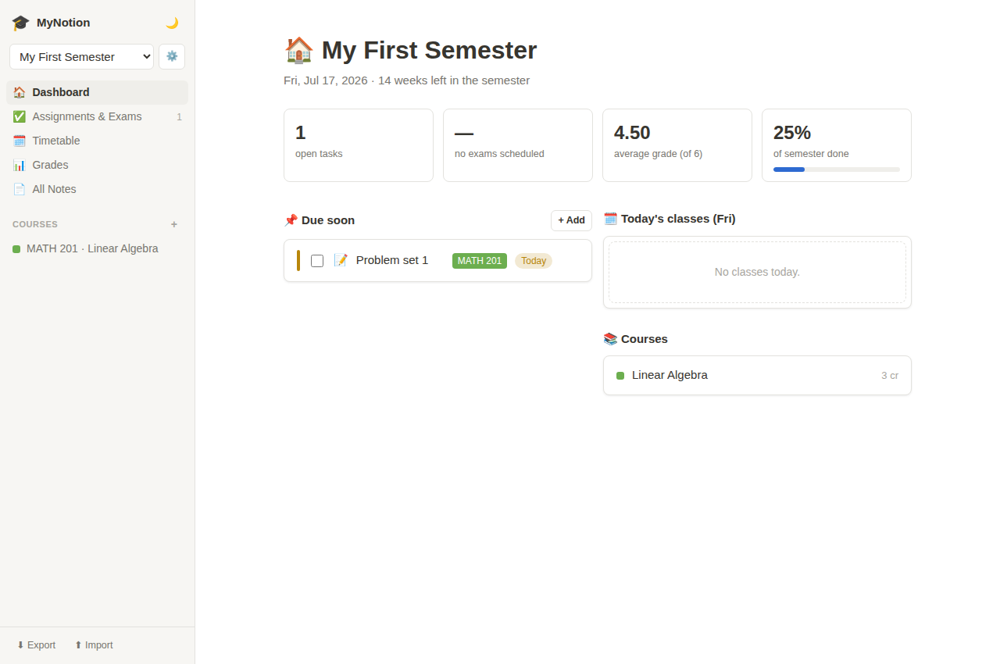

# 🎓 MyNotion — a Notion alternative built for students

Everything a student needs for a semester, in one workspace: courses, notes,
assignments, exams, a weekly timetable and a grade tracker — organized around
**semesters** instead of generic pages.



## Features

- **Quick Find (⌘K / Ctrl K)** — Notion-style search palette. Full-text search
  across every page (titles *and* note content), task, course and semester —
  including semesters you're not currently in. Matches are highlighted with a
  snippet of the surrounding text; opening a result from another semester
  switches to it automatically. With an empty query it shows recently opened
  pages, navigation and quick actions (new page, switch semester, toggle
  theme), and any query can be turned into a new page with that title.
  Fully keyboard-driven: ↑/↓ to move, ↵ to open, esc to close (⌘P works too).
- **Semesters** — switch between semesters; every course, task, note and grade
  is scoped to one. Dashboard shows how far through the semester you are.
- **Courses** — code, instructor, credits, a color, and weekly meeting times
  (day / start / end / room).
- **Dashboard** — open tasks, days until your next exam, current GPA, semester
  progress, what's due soon and today's classes.
- **Assignments & Exams** — tasks with type (assignment / exam / reading /
  project), due date, priority and course. Filter by status, type or course;
  overdue and due-soon items are highlighted.
- **Weekly timetable** — auto-generated from course meeting times, color-coded,
  weekend columns appear only if you have weekend classes.
- **Notion-style notes** — block editor with a **"/" command menu**: type `/`
  in any block to get a filterable menu of block types (text, headings,
  bulleted list, to-do, quote, code, divider). Keep typing to filter
  (`/h`, `/todo`…), ↑/↓ to navigate, ↵ to insert, esc to dismiss — or click.
  Markdown shortcuts work too: `# ` heading, `## ` subheading, `- ` bullet,
  `[] ` to-do, `> ` quote, ` ``` ` code, `---` divider. Enter continues
  lists, Backspace exits them, ⌥↑/⌥↓ moves blocks. Pages can be general or
  attached to a course.
- **Grades (Swiss system)** — grades on the Swiss 1–6 scale (6 best,
  4.0 = pass). Enter grades directly or from points using the standard formula
  (5 · points ⁄ max + 1). Course grades are weighted averages rounded to
  quarter grades (ETH-style); the semester average is credit-weighted. Failing
  grades are highlighted.
- **Calendar** — month view merging assignment deadlines, exams (highlighted)
  and your weekly classes. Click any day to add a task due that day, click a
  task to edit it; exams stand out, done tasks are struck through.
- **Flashcards with spaced repetition** — one deck per course plus a general
  deck. Review due cards in a fullscreen study mode (click/space to flip,
  rate **Again / Hard / Good / Easy**, keys 1–4); an SM-2-style scheduler
  decides when each card comes back, and cards you find hard return sooner.
  The sidebar and dashboard show how many cards are waiting.
- **Focus timer (Pomodoro)** — 15/25/50-minute focus sessions with breaks,
  tied to a course. Finished sessions are logged automatically and feed
  study-time stats: minutes today, last 7 days, and a per-course breakdown so
  you can see where your time actually goes. The countdown stays visible in
  the sidebar (and the tab title) wherever you are in the app.
- **Light & dark mode**, and **JSON export / import** for backups.

All data is stored locally in your browser (`localStorage`) — no account, no
server, fully private.

## Getting started

```bash
npm install
npm run dev      # http://localhost:5173
```

Production build: `npm run build` (output in `dist/`, deployable to any static
host — GitHub Pages, Netlify, Vercel…).

## Tech

React 18 + TypeScript + Vite, zero other runtime dependencies.

### Architecture

```
src/
  types.ts             Domain models (Semester, Course, Task, Page, GradeEntry,
                       Flashcard, StudySession)
  constants.ts         Shared constants (colors, icons, nav items, options)
  store/               App state: context provider, domain slice reducers,
                       localStorage persistence + migrations, selectors
  contexts/            Cross-cutting UI state: theme, navigation, Quick Find,
                       the app-wide focus timer
  hooks/               Generic reusable hooks (useWindowEvent, useFormState)
  utils/               Pure helpers: dates, grade math, course/meeting helpers,
                       safe storage access
  components/          Small shared UI primitives (Modal, Field, ColorDot…)
  features/            One folder per feature — each owns its views, components
                       and feature-specific logic:
                       layout, semesters, courses, tasks, notes, editor,
                       grades, timetable, calendar, flashcards, focus,
                       dashboard, quick-find
```

Conventions: components read state through context hooks (`useAppState`,
`useActiveSemester`, `useNavigation`, `useTheme`) rather than prop drilling;
business logic lives in pure functions under `utils/` and per-feature modules
so it's testable in isolation; all styling is in `src/styles.css` — dynamic
values (course colors, timetable positions) are passed as CSS custom
properties, never inline styles. To add a feature, create a folder under
`src/features/`, add a slice under `src/store/slices/` if it needs new state,
and wire its view into `src/ActiveView.tsx`.
